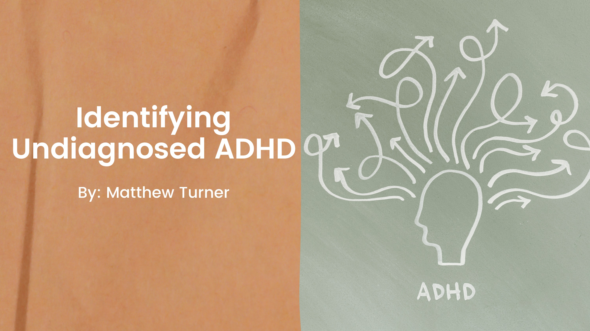
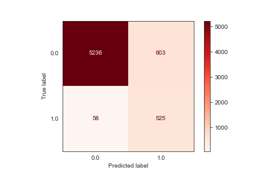

# Undiagnosed-ADHD-Identification


# Summary

The [NSCH](https://www.census.gov/programs-surveys/nsch/data/datasets.html) is a household survey that produces national
and state-level data on the physical and emotional health of children 0 - 17 years old in the United States.

In the NSCH survey data is a question that asks:

- Has a doctor or other health care provider EVER told you that this child has… Attention Deficit Disorder or
  Attention-Deficit/Hyperactivity Disorder, that is, ADD or ADHD?

In this project, I create a tool that can give the probability that a child from the NSCH survey has ADHD, **but is
undiagnosed**.
<br>

The final model has an **accuracy of 0.90** -in other words, **the model correctly classifies if a child is diagnosed
with ADHD 90% of the time**

The final model has a **precision of 0.47** —in other words, **when it predicts a child is diagnosed with ADHD, it is
correct 47% of the time**.

The final model has a **recall of 0.90** —in other words, **it correctly identifies 86% of all children diagnosed with
ADHD**.

The Next Steps I'd like to take are deploying the model to a place it can be interacted with, and adapting the model to
predict other columns

Please see the [project notebook](ADHD_Classification.ipynb) for a full walk through of the data science
process throughout the entire project.

# Introduction

ADHD is a developmental disorder associated with an ongoing pattern of inattention, hyperactivity, and/or impulsivity.
The symptoms of ADHD can interfere significantly with an individual’s daily activities and relationships. ADHD symptoms
begin in
childhood [and worsen in the teen years and adulthood](https://www.nimh.nih.gov/health/publications/adhd-what-you-need-to-know#part_6209)

ADHD comes in many forms and severities, and teenagers and adults who are undiagnosed often don't even consider they may
have ADHD if their symptoms don't perfectly match stereotypes of ADHD in the media.

# Problem

As established above, Undiagnosed ADHD can be difficult for those with it. But why is
it [so common](https://www.singlecare.com/blog/news/adhd-statistics/#adult-adhd-statistics) for ADHD to go undiagnosed?

This is a multi-pronged issue:

**ADHD is not well understood.**
ADHD is still a [subject of heavy research](https://www.cdc.gov/ncbddd/adhd/research.html) in the science/medical field.

**The way ADHD is Diagnosed.**
To be diagnosed with ADHD, you would have to specifically bring it up with your doctor; this means that if you don't
suspect you have it, you may never bring it up to your doctor on your own.

**The way ADHD is portrayed**
People with ADHD are typically portrayed as young kids, who are extremely hyper-active and disobedient. However,
hyperactivity is only one component of ADHD, and it expresses itself in various ways. Especially as kids grow older,
hyperactivity can [look very different](https://www.nytimes.com/2010/12/14/health/14klass.html) from what is portrayed
in media/pop culture.

So, is there a solution that can be reliably used that **doesn't require a deep understanding of ADHD**, and could help
spread awareness that a person may have ADHD regardless of any **personal** or **societal** bias towards what ADHD looks
like? If our hypothetical solution also used **real data** from those diagnosed with ADHD, it would definitely give it
more weight as a solution.

But does a data source like that even exist?

# Goal
The [NSCH](https://www.census.gov/programs-surveys/nsch/data/datasets.html) is a household survey that produces national
and state-level data on the physical and emotional health of children 0 - 17 years old in the United States.

In the NSCH data is a question that asks:

- Has a doctor or other health care provider EVER told you that this child has… Attention Deficit Disorder or
  Attention-Deficit/Hyperactivity Disorder, that is, ADD or ADHD?

For this project, I'm going create a tool that can give the probability that a child from the survey has ADHD, **but is
undiagnosed**.

One distinction I'd like to make: **This project is not about diagnosing kids with ADHD**. Only a trained medical
professional can diagnose someone with ADHD. This project and it's results are about spreading awareness.

# Data Cleaning

The Data file can specifically be found [here](https://www.census.gov/programs-surveys/nsch/data/datasets.html). Data in
this project is the SAS data files from 2020, 2019, 2018.

To prepare the data for cleaning I:

- Removed columns related to ADHD
- Ensured all NaN values present in the dataset were addressed
- Performed a train-test split on the data and created a holdout set.
- Saved transformed/cleaned data as CSV files.

The full data cleaning notebook can be found [here](/Notebooks/Data_Cleaning.ipynb)

# Modeling

I created 3 different types of models: [Sklearn decision tree](Notebooks/Modeling/Modeling-Decision_Tree.ipynb)
, [Catboost](Notebooks/Modeling/Modeling-Catboost.ipynb), and a [Keras neural network](Notebooks/Modeling/Modeling-Keras.ipynb).
My [final model](Notebooks/Modeling/Modeling-Catboost-Tuning.ipynb) is a Catboost model.

For each model type, created a first simple model, and iterated from it, attempting to optimize the Recall and AUC
scores.

- **Recall** because I don’t want the model to be missing kids that may have, potentially, already been passed
  over/ignored by doctors.
- AUC as a more general overview to how my model is doing

# Results

For my final model, I attempted to address the class imbalance issue first, using the random oversampling technique, I
then used the [Optuna](https://optuna.readthedocs.io/en/stable/index.html) library to perform hyper parameter tuning on
the model.

On the validation data:

The final model has an **accuracy of 0.90** -in other words, **the model correctly classifies if a child is diagnosed
with ADHD 90% of the time**

The final model has a **precision of 0.50** —in other words, **when it predicts a child is diagnosed with ADHD, it is
correct 50% of the time**.

The final model has a **recall of 0.90** —in other words, **it correctly identifies 90% of all children diagnosed with
ADHD**.


# Conclusion

I've shown that it's possible to use machine learning to accurately identify kids with ADHD. Not only this, but I've
shown it's possible to do this with just survey data, and if you can identify ADHD using survey data, it could be
possible to identify other conditions, like depression, anxiety, and autism as well. If this were to be deployed, it
could serve as a tool for those seeking answers, but unable to see a doctor to get an official diagnoses.

For a full narrative walk through and summary of all notebooks please see
the [ADHD Classification](ADHD_Classification.ipynb) notebook, or see my [presentation](presentation.pdf)

# Repository Structure

```
├── Images                              <- Directory containing graphs and images from notebooks and presentation
│   └── ...
│
├── Model                               <- Directory containing the final model in cbm format
│   └── final_model.cbm
│
├── Notebooks                           <- Directory of detailed walkthroughs of project in Jupyter notebooks.
│   │
│   ├── Modeling                        <- Directory containing all Notebooks related to the modeling process.
│   │   └── ...
│   ├── Data_Cleaning.ipynb             <- Detailed narrative walkthrough of data cleaning proccess.
│   │ 
│   └── EDA.ipynb                       <- Detailed narrative walkthrough of exploratory data analysis.
│       
├── ADHD_Classification.ipynb           <- Narrative summary of project in Jupyter notebook.
│ 
├── README.md                           <- Top-level README.
│ 
├── functions.py                        <- Helper functions for all Jupyter notebooks.
│ 
├── environment.yml                     <- The YML file for reproducing analysis environment.
│ 
└── presentation.pdf                    <- PDF version of project presentation.
``` 